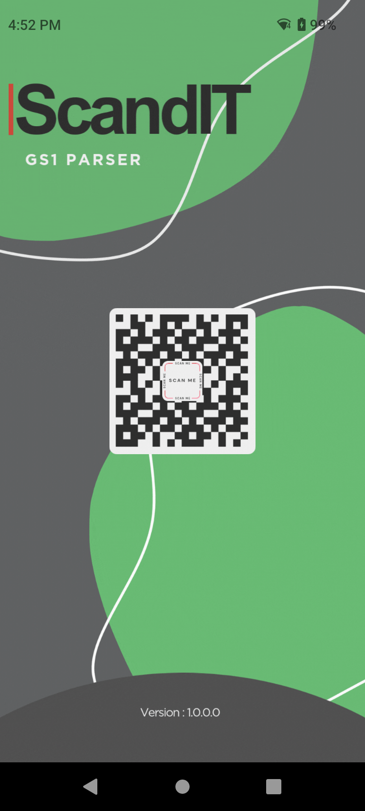
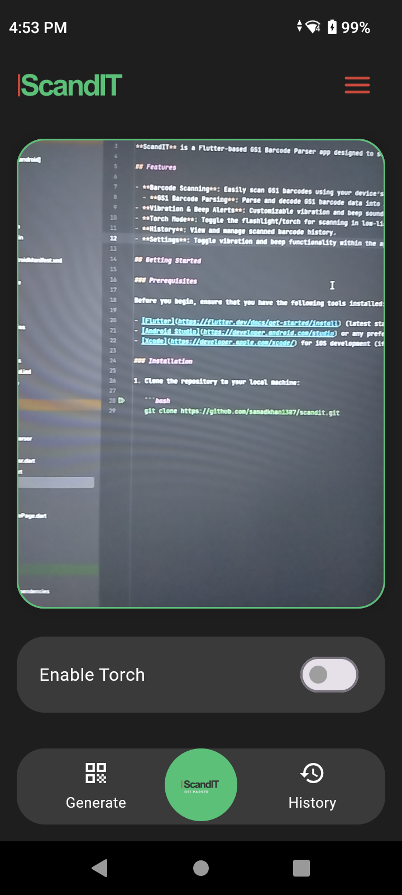
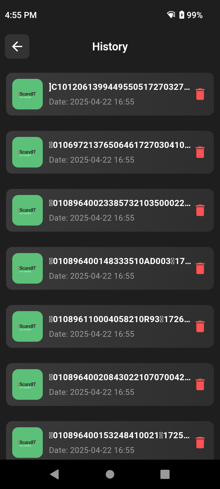
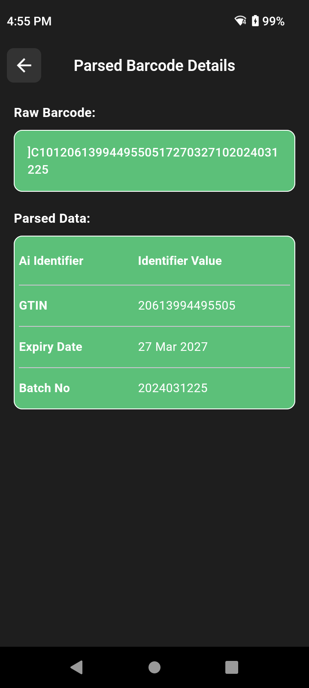
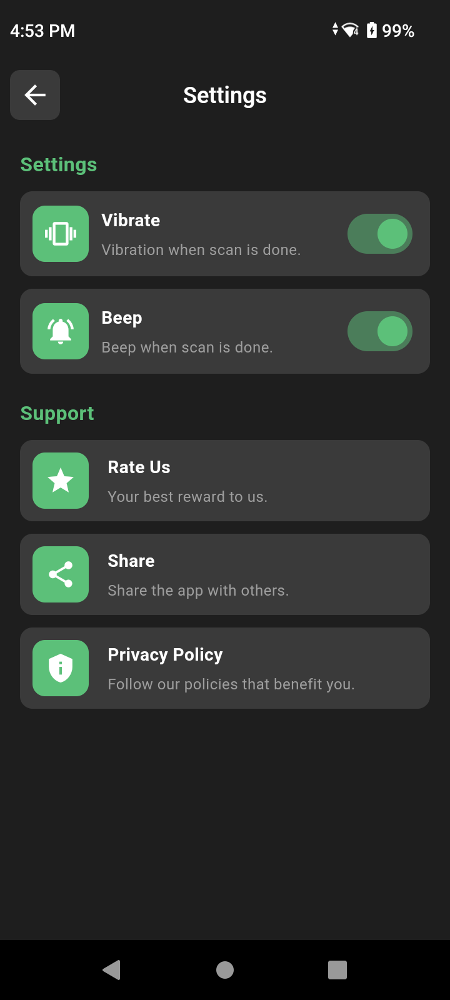

# ScandIT - GS1 Barcode Parser

**ScandIT** is a Flutter-based GS1 Barcode Parser app designed to scan and parse GS1 barcodes, providing an efficient way to process and retrieve barcode data for further use.

## Features

- **Barcode Scanning**: Easily scan GS1 barcodes using your device’s camera.
  - **GS1 Barcode Parsing**: Parse and decode GS1 barcode data into a readable format though GS1 parser Library.
- **Vibration & Beep Alerts**: Customizable vibration and beep sounds when a barcode is successfully scanned.
- **Torch Mode**: Toggle the flashlight/torch for scanning in low-light conditions.
- **History**: View and manage scanned barcode history.
- **Settings**: Toggle vibration and beep functionality within the app.

## Getting Started

### Prerequisites

Before you begin, ensure that you have the following tools installed:

- [Flutter](https://flutter.dev/docs/get-started/install) (latest stable version)
- [Android Studio](https://developer.android.com/studio) or any preferred IDE (e.g., VSCode)
- [Xcode](https://developer.apple.com/xcode/) for iOS development (if applicable)

### Installation

1. Clone the repository to your local machine:

   ```bash
   git clone https://github.com/samadkhan1387/scandit.git


## App Screenshots

Below are the app screenshots showcasing different Login Ui Design:

<table>
  <tr>
    <td></td>
    <td></td>
    <td></td>
  </tr>
  <tr>
    <td></td>
    <td></td>
    </tr>
</table>